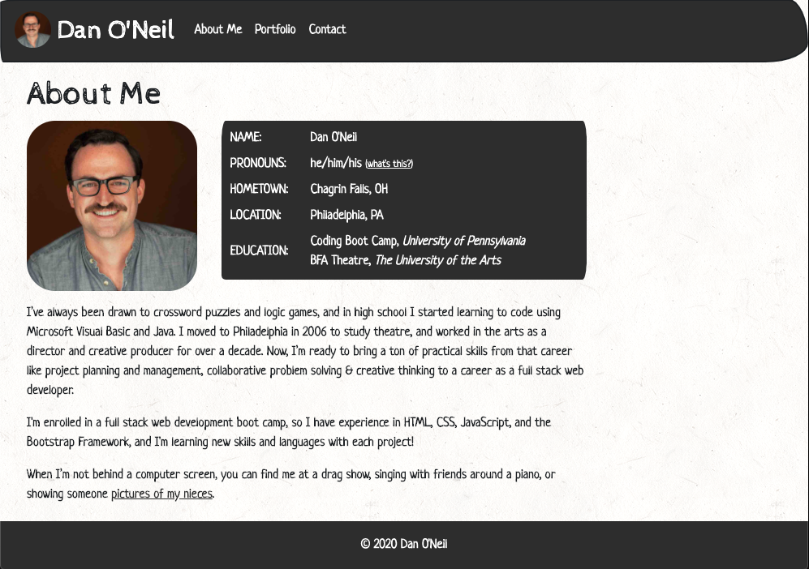
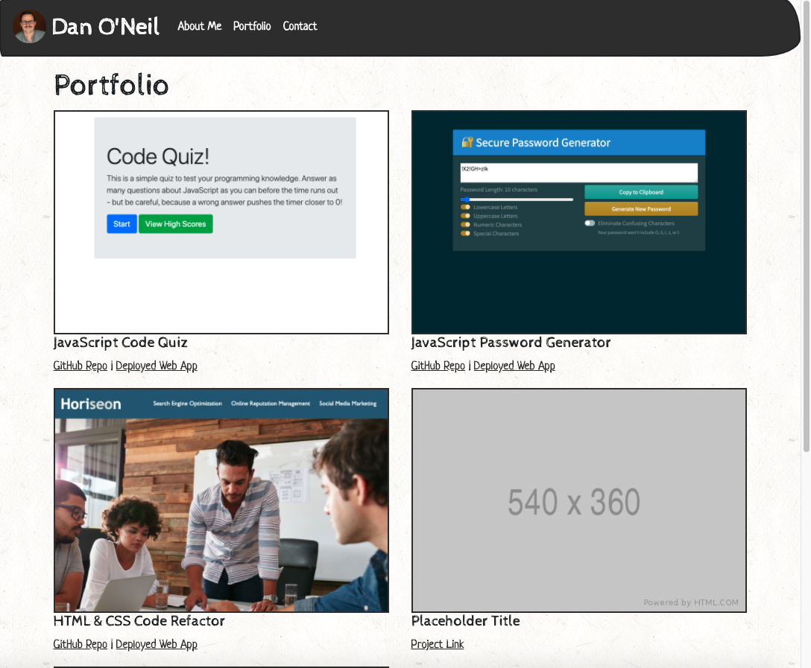
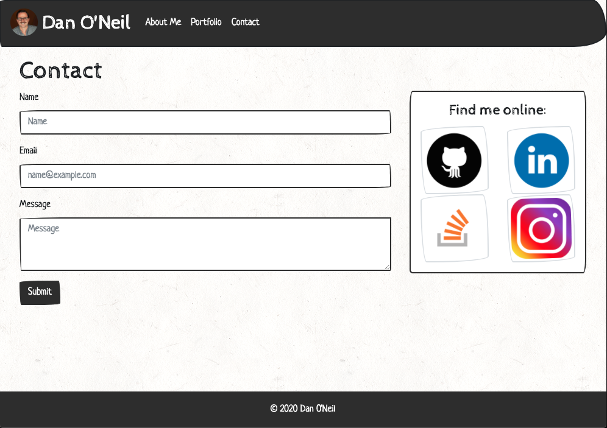

# Responsive Portfolio
This portfolio was created to showcase my work in the Penn LPS Full Stack Coding Boot Camp.

This responsive web application was made using the [Bootstrap 4.5](https://getbootstrap.com/) framework, and has breakpoints at 576px, 768px, 992px, and 1200px. I used the "Sketchy" [Bootswatch](https://bootswatch.com/) theme to style the framework, and the background pattern is "Light Paper Fibers" from [Toptal Subtle Patterns](https://www.toptal.com/designers/subtlepatterns/).

## Screenshots
[View the deployed web application.](https://dandandanoneil.github.io/responsive-portfolio/index.html)

Landing page / About Me:

Portfolio:

Contact:

## License
[MIT License](http://opensource.org/licenses/mit-license.php)

> Written with [StackEdit](https://stackedit.io/).
